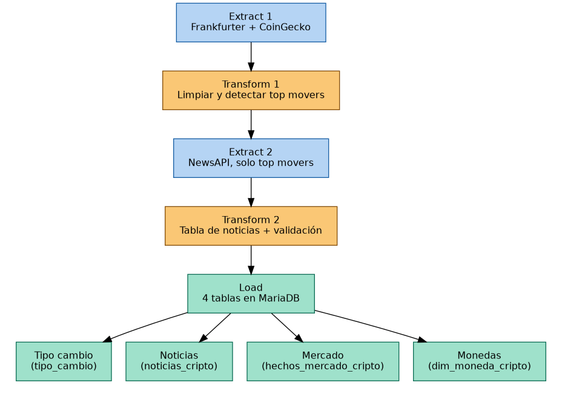

# Flujo del ETL cripto

## Por qué dos rondas de Extract-Transform

El azul es **Extract**, el ámbar es **Transform**, el verde es **Load**. El patrón no es
E → T → L simple porque el enriquecimiento con noticias depende de una decisión que solo
se puede tomar *después* de limpiar los datos de mercado:

1. **Extract 1** trae mercado (CoinGecko) y tipo de cambio (Frankfurter) — datos crudos,
   sin decisiones todavía.
2. **Transform 1** limpia esos datos y decide algo nuevo: cuáles monedas son "top movers"
   (las 5 que más subieron y las 5 que más bajaron en 24h).
3. **Extract 2** solo existe gracias al paso anterior — es una segunda llamada a una API
   (NewsAPI), pero ahora sabe *a quién* preguntarle porque el Transform 1 se lo dijo.
4. **Transform 2** arma la tabla de noticias final (descartando las monedas sin artículo
   real) y corre la validación de calidad antes de cargar.
5. **Load** reparte el resultado en 4 tablas normalizadas en vez de una sola tabla ancha.

Es un patrón real de pipelines de enriquecimiento, no una complicación artificial —
por eso vale la pena que el diagrama lo deje explícito en vez de dibujar un flujo lineal
de una sola pasada.

## Las 4 tablas del Load

| En el diagrama | Tabla real | Qué guarda |
|---|---|---|
| Monedas | `dim_moneda_cripto` | Catálogo de monedas — no se repite en cada snapshot |
| Mercado | `hechos_mercado_cripto` | El snapshot de precio/volumen/cambio % de cada corrida |
| Noticias | `noticias_cripto` | Solo las monedas que sí tuvieron un artículo real |
| Tipo cambio | `tipo_cambio` | Compartida con `recursos/etl-tipo-cambio/` — mismo esquema |

Ver [`README.md`](README.md) para el detalle de instalación y uso, y
[`ETL_Crypto_Dash_mejorado.ipynb`](ETL_Crypto_Dash_mejorado.ipynb) para el código completo.
