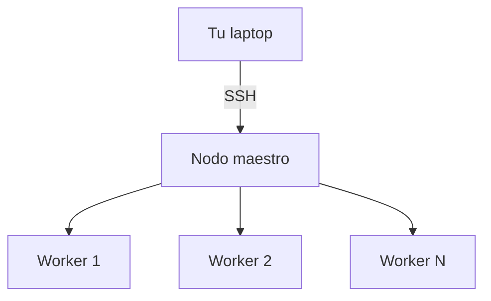

# Sesión 00
## Prerequisito obligatorio

Maestría en Ciencia de Datos — Big Data

<div class="pt-12 text-sm opacity-60">
Linux · Python · SQL · GCP — el checkpoint que abre la puerta a la Sesión 1
</div>

---

# El ritmo desde el día uno es alto

<v-clicks>

- No hay tiempo de clase para nivelar Python/SQL básico
- Por eso este módulo **se evalúa** — a diferencia de Especialidad
- Quien no pasa el checkpoint recibe material de refuerzo **antes** de la Sesión 1

</v-clicks>

<div v-click class="mt-8 text-blue-500 font-bold">
No es un filtro de acceso — es una garantía de que nadie se atrasa al grupo
</div>

---
layout: two-cols
layoutClass: gap-8
---

# Linux: lo que sí vas a usar

Un cluster de Spark vive en GCP, no en tu laptop. Estas tres herramientas son
cómo lo operas como si estuviera enfrente de ti:

- **SSH** — tu único túnel al cluster remoto
  <br><span class="text-sm opacity-70">`gcloud compute ssh <instancia>`</span>
- **Procesos** — `ps aux`, `kill <pid>`
  <br><span class="text-sm opacity-70">matar un worker zombie sin reiniciar el cluster completo</span>
- **Permisos** — `chmod +x`
  <br><span class="text-sm opacity-70">un script de init sin permiso de ejecución falla en silencio, difícil de diagnosticar si no sabes qué buscar</span>

::right::



---

# Python: dos hábitos que se traducen directo a Spark

PySpark se siente como Python normal, pero corre distribuido — entender bien
las estructuras nativas evita errores sutiles al traducir lógica a Spark.

```python {1-2|4-5|all}
# List comprehension — el mismo patrón mental que un .select() de Spark
cuadrados = [x**2 for x in rango]

# df.select(F.col("x") ** 2)  <- Sesión 5, mismo concepto, distribuido
```

<div v-click class="mt-6">

**Excepciones importan más aquí que en un script local:** un job de Spark que falla
a mitad de 20GB no te da un traceback claro de "qué fila lo rompió" sin que tú lo
hayas anticipado — ver `05_data_cleansing.ipynb`.

</div>

---

# SQL: la escalera hacia BigQuery (Sesión 2)

| Nivel | Qué agrega | Dónde lo usas después |
|---|---|---|
| JOINs complejos | `LEFT JOIN` sin perder filas silenciosamente (los que no matchan quedan con `NULL`, no desaparecen) | Cualquier pipeline con más de una tabla |
| Window functions | `RANK() OVER (PARTITION BY...)` — calcula por fila, mirando un grupo relacionado, sin colapsarlo como un `GROUP BY` | `03_spark_sql.ipynb` — ranking de transacciones sospechosas |
| CTEs recursivos | `WITH RECURSIVE` — para jerarquías sin profundidad fija (ej. cadenas de referidos) | BigQuery avanzado, Sesión 2 |

<div v-click class="text-sm opacity-70 mt-4">
Practica con recursos/sql-practica/employee_db_queries.sql — completo, no solo las primeras secciones
</div>

---

# GCP: dos comandos que evitan el 90% de los "¿por qué no funciona?"

```bash{1|2}
gcloud config set project <ID>      # el error #1: proyecto activo incorrecto
gcloud compute ssh <instancia>       # tu entrada al cluster
```

Olvidar el primer comando es la causa más común de "¿por qué mi cluster no
aparece?" — se creó en otro proyecto sin que te dieras cuenta.

<div v-click class="mt-8">

**IAM básico hoy, IAM a nivel tabla en la Sesión 13** — mismo principio,
más granular: mínimo privilegio, nunca "Owner para todos porque es más simple".

</div>

---
layout: center
class: text-center
---

# Práctica dirigida antes del checkpoint

50 min: `recursos/sql-practica/employee_db_queries.sql` completo, en parejas —
alternando quién escribe y quién interpreta el resultado

<div class="mt-6 text-sm opacity-70">
+ 30 min: simulacro con 2-3 preguntas del mismo estilo del checkpoint real
</div>

---

# Checkpoint de admisión

Individual, sin ayuda de compañeros. Quiz corto + mini-ejercicio de SQL y Python.

<div class="mt-8 text-xl text-blue-500">
Entregable: checkpoint aprobado + proyecto GCP configurado
</div>

<div class="mt-6 text-sm opacity-70">
Quien no pasa hoy no se queda fuera del curso — recibe material de refuerzo antes de la Sesión 1
</div>

<div class="mt-12 text-sm opacity-60">
→ Sesión 01: Arquitecturas distribuidas (HDFS, CAP, MapReduce, Spark)
</div>
