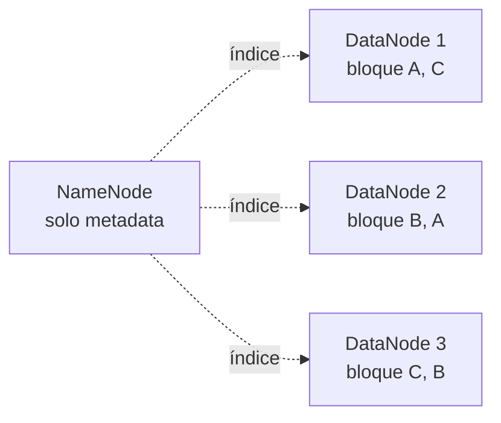
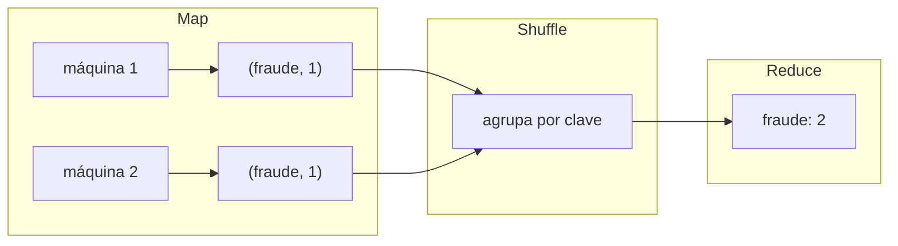

# Sesión 01
## Arquitecturas distribuidas

<div class="pt-6 text-sm opacity-60">
Si esto no queda sólido, Spark se siente como sintaxis — no como una solución a un problema real
</div>

---

# Un archivo de 10TB no cabe en un disco

<v-clicks>

- Ni siquiera si cupiera, leerlo secuencial tomaría horas
- **La solución: partirlo y repartirlo** — eso es HDFS
- Cloud Storage (lo que usa este curso) resuelve el mismo problema, como servicio administrado

</v-clicks>

---

# HDFS: partición + replicación



<div v-click>

**Replicación x3 no es paranoia — es la estrategia de tolerancia a fallos.**
A escala de miles de discos, las fallas son casi diarias, estadísticamente.

</div>

---

# CAP: solo puedes elegir 2 de 3, y P no es opcional

<div class="grid grid-cols-3 gap-4 mt-8 text-center">
<div class="p-4 border rounded">
<div class="text-2xl">C</div>
Consistencia
</div>
<div class="p-4 border rounded">
<div class="text-2xl">A</div>
Disponibilidad
</div>
<div class="p-4 border rounded border-blue-500 text-blue-500">
<div class="text-2xl">P</div>
Tolerancia a particiones
</div>
</div>

<div v-click class="mt-8 text-lg">
La red <b>siempre</b> se va a particionar eventualmente — la decisión real es entre <b>C</b> y <b>A</b>
</div>

<div v-click class="mt-4 text-sm opacity-70">
BigQuery elige CP (esperar a estar completo y correcto) · Sistemas de caché eligen AP (responder rápido, aunque desactualizado)
</div>

---

# MapReduce: map → shuffle → reduce



<div v-click class="text-sm opacity-70 mt-4">
`recursos/spark/01_rdd_basico.ipynb` implementa esto con reduceByKey sobre war_tweets.txt
</div>

---

# Por qué Spark reemplazó a MapReduce puro

<v-clicks>

- **Todo pasa por disco en MapReduce clásico** — cada etapa lee/escribe a HDFS
- **Spark mantiene datos en memoria** (RDDs) entre etapas
- El paper original (Zaharia et al., 2012) reporta hasta **100x** en cargas iterativas
- Spark planea un **DAG completo** antes de ejecutar — MapReduce obliga a una secuencia rígida

</v-clicks>

---

# Lab de hoy

```bash
gcloud dataproc clusters create curso-cluster --num-workers=2 ...
```

1. Crear un cluster de Managed Service for Apache Spark
2. Correr un word count en MapReduce clásico **y** su equivalente en Spark
3. Leer los logs (YARN/Spark UI) para diagnosticar cuellos de botella

<div class="mt-8 text-blue-500 font-bold">
Entregable: benchmark propio (tiempos, memoria) MapReduce vs Spark
</div>

---
layout: center
class: text-center
---

# → Sesión 02

SQL distribuido avanzado — el motor de BigQuery, particionamiento, y por qué `SELECT *` cuesta lo que cuesta
