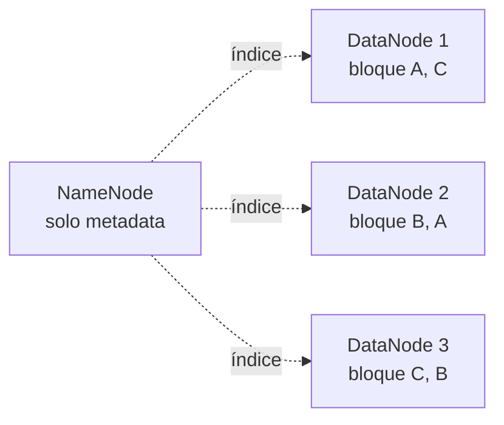
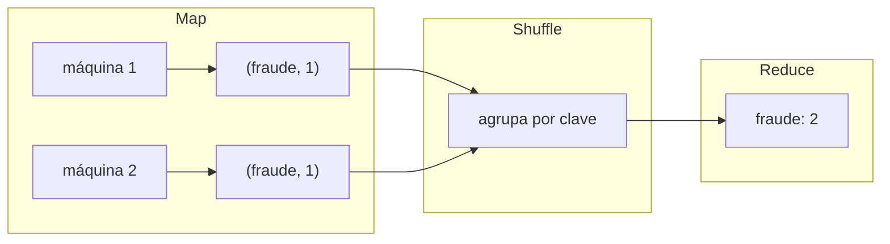

# Sesión 01
## Arquitecturas distribuidas

<div class="pt-6 text-sm opacity-60">
Si esto no queda sólido, Spark se siente como sintaxis — no como una solución a un problema real
</div>

---

# Un archivo de 10TB no cabe en un disco

<v-clicks>

- Ni siquiera si cupiera, leerlo secuencial tomaría horas
- **La solución: partirlo y repartirlo** — eso es HDFS
- Cloud Storage (lo que usa este curso) resuelve el mismo problema, como servicio administrado

</v-clicks>

---

# HDFS: bloques, partición, replicación

Un archivo se corta en **bloques** (típicamente 128MB), y cada bloque se guarda
en el disco local de alguna máquina del cluster.



- **NameNode** — no guarda datos, guarda *metadata*: qué bloques componen un
  archivo y en qué DataNodes viven
- **DataNode** — guarda los bloques en su disco local

<div v-click>

**Replicación x3 no es paranoia — es la estrategia de tolerancia a fallos.**
A escala de miles de discos, las fallas son casi diarias, estadísticamente.

</div>

---

# CAP: solo puedes elegir 2 de 3, y P no es opcional

<div class="grid grid-cols-3 gap-4 mt-8 text-center">
<div class="p-4 border rounded">
<div class="text-2xl">C</div>
Consistencia
</div>
<div class="p-4 border rounded">
<div class="text-2xl">A</div>
Disponibilidad
</div>
<div class="p-4 border rounded border-blue-500 text-blue-500">
<div class="text-2xl">P</div>
Tolerancia a particiones
</div>
</div>

<div v-click class="mt-8 text-lg">
La red <b>siempre</b> se va a particionar eventualmente (un cable se corta, un switch falla) — la decisión real es entre <b>C</b> y <b>A</b>
</div>

<div v-click class="mt-4 text-sm opacity-70">
BigQuery elige CP (esperar a estar completo y correcto) · Sistemas de caché eligen AP (responder rápido, aunque desactualizado)
</div>

---

# MapReduce: map → shuffle → reduce



1. **Map** — cada máquina procesa su porción, emite pares `(clave, valor)`
2. **Shuffle** — el framework redistribuye para que la misma clave termine en
   la misma máquina (la etapa más cara: mueve datos por la red)
3. **Reduce** — cada máquina agrega los valores que le tocaron por clave

<div v-click class="text-sm opacity-70 mt-4">
`recursos/spark/01_rdd_basico.ipynb` implementa esto con reduceByKey sobre war_tweets.txt
</div>

---

# Por qué Spark reemplazó a MapReduce puro

<v-clicks>

- **Todo pasa por disco en MapReduce clásico** — cada etapa lee/escribe a HDFS
- **Spark mantiene datos en memoria** (RDDs) entre etapas
- El paper original (Zaharia et al., 2012) reporta hasta **100x** en cargas iterativas
- Spark planea un **DAG completo** antes de ejecutar — MapReduce obliga a una secuencia rígida

</v-clicks>

---
layout: center
class: text-center
---

# Lab de hoy

Primer cluster del curso — dedica tiempo a crearlo bien, no lo hagas tú por el grupo

---

# Paso 1 — Crear el cluster

```bash
export BUCKET_NAME=<tu-bucket>
gcloud dataproc clusters create curso-cluster \
    --region=us-central1 --num-workers=3 \
    --optional-components=JUPYTER,ZEPPELIN --enable-component-gateway \
    --max-idle=1h --max-age=3h
```

<div class="mt-6 p-3 border-l-4 border-blue-500 text-sm text-left">
<b>Deberías ver:</b> el cluster pasa a <code>RUNNING</code> en 7-10 minutos.
<br><b>Si falla por cuota:</b> revisa <code>gcloud compute regions describe us-central1</code> antes de reintentar.
</div>

---

# Paso 2 — Word count: MapReduce vs. Spark

```python
conteo = (
    sc.textFile("gs://<TU-BUCKET>/war_tweets.txt")
    .flatMap(lambda linea: linea.split())
    .map(lambda palabra: (palabra, 1))
    .reduceByKey(lambda a, b: a + b)
)
conteo.take(10)
```

<div class="mt-6 text-sm opacity-70">
Mientras corre: abre el Spark UI — la pestaña Stages muestra exactamente las
etapas de map y shuffle que acabas de escribir en código. No es una caja negra.
</div>

<div class="mt-4 text-sm opacity-70">
Si el archivo completo (22GB) tarda demasiado para la sesión, usa una muestra (<code>head -n 100000</code>)
</div>

---

# Paso 3 — Leer los logs para diagnosticar

Abre el Spark UI (componente gateway del cluster), pestaña **Stages**.

<div class="mt-6 text-blue-500 font-bold">
¿Cuál etapa tardó más, y por qué?
</div>

<div class="mt-8 p-4 border-l-4 border-blue-500">
Entregable: benchmark propio (tiempos, uso de memoria) MapReduce vs Spark — capturar del Spark UI antes de apagar el cluster
</div>

---

# No olvides apagar el cluster

```bash
gcloud dataproc clusters delete curso-cluster --region=us-central1
```

---
layout: center
class: text-center
---

# → Sesión 02

SQL distribuido avanzado — el motor de BigQuery, particionamiento, y por qué `SELECT *` cuesta lo que cuesta
