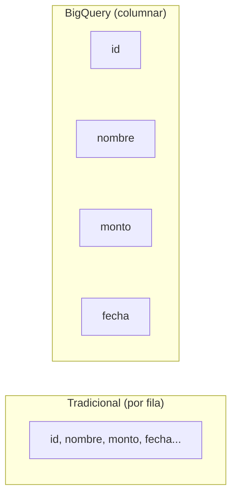

# Sesión 02
## SQL distribuido avanzado

<div class="pt-6 text-sm opacity-60">
No es "SQL más complejo" — es entender qué pasa adentro para no optimizar a ciegas
</div>

---

# BigQuery guarda columnas, no filas



<div v-click class="mt-6 text-xl">
<code>SELECT *</code> cuesta como si necesitaras todas las columnas — aunque uses 3 de 50
</div>

---

# Particionamiento: el archivero con un cajón por mes

<v-clicks>

- Sin partición: `WHERE fecha = '2026-01-01'` escanea **toda** la tabla
- Con partición por fecha: solo abre el cajón de ese día
- **Clustering** (hasta 4 columnas): ordena físicamente *dentro* de cada partición

</v-clicks>

<div v-click class="mt-8 p-4 border-l-4 border-blue-500">
recursos/hive/hive-queries.sql Sección 3 — compara el tiempo real, sin particionar (3.1) vs particionada (3.2/3.3), sobre datos de la FGJ CDMX
</div>

---

# Dos formas de pagar, y confundirlas sale caro

| Modelo | Se cobra por | Conviene si... |
|---|---|---|
| **On-demand** | TB escaneados | Uso esporádico (este curso) |
| **Capacity-based** | Slots reservados | Uso constante y predecible |

<div v-click class="mt-8 text-blue-500 font-bold">
Cada byte de más (por un SELECT * innecesario) sale directo de tu presupuesto mensual de 1TB
</div>

---

# Window functions anidadas + CTEs recursivos

```sql {1-8|10-18}
-- Window function: ranking dentro de cada grupo
SELECT sucursal, tipo_transaccion, monto,
       RANK() OVER (
         PARTITION BY tipo_transaccion
         ORDER BY monto DESC
       ) AS ranking
FROM transacciones;

-- CTE recursiva: jerarquía sin profundidad fija
WITH RECURSIVE cadena_referidos AS (
  SELECT cliente_id, referido_por, 1 AS nivel
  FROM clientes WHERE referido_por IS NULL
  UNION ALL
  SELECT c.cliente_id, c.referido_por, cr.nivel + 1
  FROM clientes c
  JOIN cadena_referidos cr ON c.referido_por = cr.cliente_id
)
SELECT * FROM cadena_referidos ORDER BY nivel;
```

---

# Lab + entregable de hoy

1. Rediseñar una tabla mal particionada
2. Medir la reducción de costo/latencia — **con evidencia visual**
3. Escribir consultas con window functions anidadas y CTEs recursivos

<div class="mt-8 p-4 border-l-4 border-blue-500">
Entregable: reporte antes/después + <b>una gráfica de barras</b> (bytes escaneados o tiempo) — no basta el número en texto
</div>

---
layout: center
class: text-center
---

# → Sesión 03

Spark Core avanzado — Catalyst, shuffle, skew, y cómo leer un plan de ejecución
