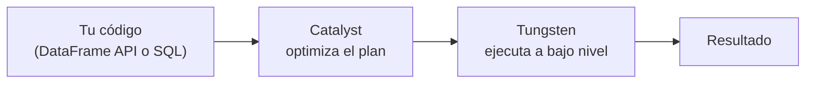
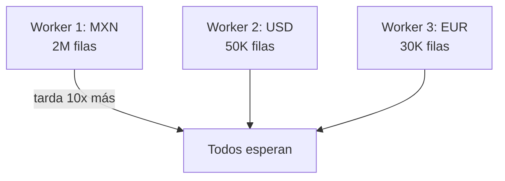

# Sesión 03
## Spark Core avanzado

<div class="pt-6 text-sm opacity-60">
Hoy se abre la caja: por qué Spark es rápido, y qué puede salir mal a escala
</div>

---

# Tu código no se ejecuta tal cual lo escribiste



<v-clicks>

- **Catalyst:** elimina columnas sin usar, empuja filtros al origen, reordena joins
- **Tungsten:** memoria fuera del heap de la JVM + bytecode generado en tiempo real

</v-clicks>

<div v-click class="mt-6 text-sm opacity-70">
DataFrame API y SQL puro generan el mismo plan — ambos pasan por Catalyst
</div>

---

# Shuffle: la operación más cara de Spark

| Tipo | Cuándo ocurre |
|---|---|
| Por agregación | `groupBy`, `reduceByKey` |
| **Por join** | El más costoso — mueve datos de ambos lados |
| Por repartición | `.repartition()` explícito |

<div v-click class="mt-8 text-xl text-blue-500">
Un shuffle mueve datos por la red entre máquinas — eso es lo que cuesta
</div>

---

# Skew: cuando una clave concentra el trabajo



<div v-click class="mt-4">
El resto del cluster termina y <b>espera ocioso</b> a que uno solo acabe
</div>

---

# Tres formas de mitigar skew

<v-clicks>

- **Salting** — sufijo aleatorio a la clave sesgada, repartiendo artificialmente
- **Broadcast join** — la tabla pequeña se copia entera a cada worker, sin shuffle
- **AQE** (Adaptive Query Execution) — Spark re-optimiza *durante* la corrida, con estadísticas reales

</v-clicks>

<div v-click class="mt-8 text-sm opacity-70">
AQE está activado por default desde Spark 3.x — reduce la necesidad de salting manual
</div>

---

# `.explain()`: qué buscar

```python
df.explain(mode="formatted")
```

| Ves esto | Significa |
|---|---|
| `Exchange` | Un shuffle |
| `BroadcastHashJoin` | Barato — tabla pequeña enviada completa |
| `SortMergeJoin` | Shuffle de ambos lados |
| `PushedFilters` | El filtro se empujó hasta el origen — leyendo menos |

---

# Lab de hoy

1. Diagnosticar un job con **skew severo** (dataset sintético desbalanceado)
2. Comparar el plan de ejecución **antes** y **después** de la corrección

<div class="mt-8 p-4 border-l-4 border-blue-500">
recursos/spark/02_dataframes.ipynb y 03_spark_sql.ipynb ya imprimen el plan físico — úsalos como punto de partida
</div>

<div class="mt-6 text-blue-500 font-bold">
Entregable: notebook con diagnóstico + solución + métricas de mejora
</div>

---
layout: center
class: text-center
---

# → Sesión 04

Ingeniería de features a escala — Pipeline, Transformer, Estimator de MLlib
