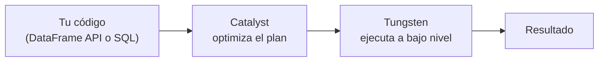

# Sesión 03
## Spark Core avanzado I
### Catalyst y shuffle

<div class="pt-6 text-sm opacity-60">
Primera de dos sesiones sobre el motor interno de Spark — hoy: por qué es rápido, y cómo leer lo que va a ejecutar
</div>

---

# Tu código no se ejecuta tal cual lo escribiste



<v-clicks>

- **Catalyst** — el optimizador de consultas: toma tu código (DataFrame API o
  SQL, es indistinto) y aplica reglas de reescritura — elimina columnas sin
  usar (*column pruning*), empuja filtros al origen (*predicate pushdown*),
  reordena joins si reduce el trabajo total
- **Tungsten** — el motor de ejecución de bajo nivel: memoria fuera del heap
  de la JVM (evita el costo del garbage collector) + bytecode generado en
  tiempo real para cada consulta específica

</v-clicks>

<div v-click class="mt-6 text-sm opacity-70">
DataFrame API y SQL puro generan el mismo plan lógico — ambos pasan por Catalyst
</div>

---

# Shuffle: la operación más cara de Spark

Ocurre cuando Spark necesita mover datos entre particiones a través de la red
— típicamente porque una operación necesita juntar filas que estaban en
máquinas distintas.

| Tipo | Cuándo ocurre |
|---|---|
| Por agregación | `groupBy`, `reduceByKey` — redistribuye para que la misma clave termine junta |
| **Por join** | El más costoso — mueve datos de **ambos** lados |
| Por repartición | `.repartition()` explícito |

<div v-click class="mt-6 text-sm opacity-70">
La Sesión 4 profundiza en qué hacer cuando uno de estos shuffles está desbalanceado
</div>

---

# `.explain()`: qué buscar

`.explain(mode="formatted")` imprime el plan de ejecución real que Catalyst
decidió — no lo que escribiste, sino cómo se va a ejecutar.

```python
df.explain(mode="formatted")
```

| Ves esto | Significa |
|---|---|
| `Exchange` | Un shuffle — si ves más de los que esperabas, ahí está el costo oculto |
| `BroadcastHashJoin` | Barato — tabla pequeña enviada completa a cada worker |
| `SortMergeJoin` | Shuffle de ambos lados |
| `PushedFilters` | Confirma si el filtro se empujó hasta el origen (leyendo menos) |

---
layout: center
class: text-center
---

# Lab de hoy

Puramente diagnóstico — hoy solo se lee, la Sesión 4 resuelve

---

# Paso 1 — Correr ambos notebooks

```python
# 02_dataframes.ipynb
df.filter(...).groupBy(...).explain(mode="formatted")
```

```python
# 03_spark_sql.ipynb — la MISMA pregunta, en SQL
spark.sql("SELECT ... GROUP BY ...").explain(mode="formatted")
```

<div class="mt-6 p-3 border-l-4 border-blue-500 text-sm text-left">
<b>Deberías ver:</b> dos planes con la misma estructura de fondo (mismo número
de <code>Exchange</code>, mismo tipo de join).
</div>

---

# Paso 2 — Contar shuffles en cada plan

En parejas: cada quien cuenta los `Exchange` del plan que le tocó y explica
en voz alta qué operación lo generó, antes de comparar con su pareja.

<div class="mt-6 text-blue-500 font-bold">
¿Los dos planes tienen el mismo número de Exchange? Si no, ¿por qué?
</div>

---

# Paso 3 — Documentar el entregable

Capturas de los dos planes comparados + la lista de shuffles identificados,
con la operación que los originó cada uno.

<div class="mt-8 p-4 border-l-4 border-blue-500 font-bold">
Hoy solo diagnosticamos. La Sesión 4 da un caso donde el plan revela un
problema real — una clave que concentra el 80% del trabajo — y lo resolvemos.
</div>

---
layout: center
class: text-center
---

# → Sesión 04

Spark Core avanzado II — skew y diagnóstico completo
