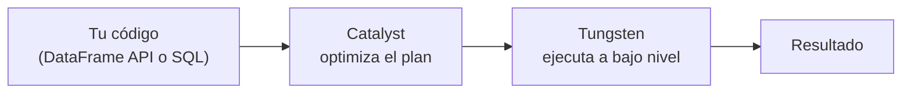

# Sesión 03
## Spark Core avanzado I
### Catalyst y shuffle

<div class="pt-6 text-sm opacity-60">
Primera de dos sesiones sobre el motor interno de Spark — hoy: por qué es rápido, y cómo leer lo que va a ejecutar
</div>

---

# Tu código no se ejecuta tal cual lo escribiste



<v-clicks>

- **Catalyst:** elimina columnas sin usar, empuja filtros al origen, reordena joins
- **Tungsten:** memoria fuera del heap de la JVM + bytecode generado en tiempo real

</v-clicks>

<div v-click class="mt-6 text-sm opacity-70">
DataFrame API y SQL puro generan el mismo plan — ambos pasan por Catalyst
</div>

---

# Shuffle: la operación más cara de Spark

| Tipo | Cuándo ocurre |
|---|---|
| Por agregación | `groupBy`, `reduceByKey` |
| **Por join** | El más costoso — mueve datos de ambos lados |
| Por repartición | `.repartition()` explícito |

<div v-click class="mt-8 text-xl text-blue-500">
Un shuffle mueve datos por la red entre máquinas — eso es lo que cuesta
</div>

<div v-click class="mt-6 text-sm opacity-70">
La Sesión 4 profundiza en qué hacer cuando uno de estos shuffles está desbalanceado
</div>

---

# `.explain()`: qué buscar

```python
df.explain(mode="formatted")
```

| Ves esto | Significa |
|---|---|
| `Exchange` | Un shuffle |
| `BroadcastHashJoin` | Barato — tabla pequeña enviada completa |
| `SortMergeJoin` | Shuffle de ambos lados |
| `PushedFilters` | El filtro se empujó hasta el origen — leyendo menos |

---

# Lab de hoy

1. Correr `02_dataframes.ipynb` (DataFrame API) y `03_spark_sql.ipynb` (SQL puro) sobre el mismo dataset
2. Comparar ambos planes — confirmar que son equivalentes
3. Identificar cada `Exchange` y qué operación lo generó

<div class="mt-8 text-blue-500 font-bold">
Entregable: capturas de los dos planes comparados + lista de shuffles identificados
</div>

---
layout: center
class: text-center
---

# → Sesión 04

Spark Core avanzado II — skew y diagnóstico completo
