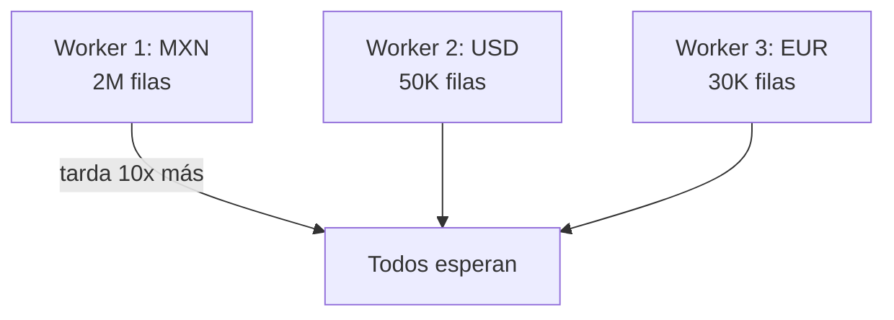

# Sesión 04
## Spark Core avanzado II
### Skew y diagnóstico

<div class="pt-6 text-sm opacity-60">
La Sesión 3 dejó el diagnóstico — hoy se resuelve el caso más común y más caro de performance distribuido
</div>

---

# Skew: cuando una clave concentra el trabajo



<div v-click class="mt-4">
El resto del cluster termina y <b>espera ocioso</b> a que uno solo acabe
</div>

<div v-click class="mt-4 text-sm opacity-70">
No se ve en un .count() global — hay que mirar la duración por task en el Spark UI
</div>

---

# Tres formas de mitigar skew

<v-clicks>

- **Salting** — sufijo aleatorio a la clave sesgada, repartiendo artificialmente
- **Broadcast join** — la tabla pequeña se copia entera a cada worker, sin shuffle
- **AQE** (Adaptive Query Execution) — Spark re-optimiza *durante* la corrida, con estadísticas reales

</v-clicks>

<div v-click class="mt-8 text-sm opacity-70">
AQE está activado por default desde Spark 3.x — reduce la necesidad de salting manual
</div>

---

# Salting, en código

```python {1-2|3-8|9-13}
df_salado = df.withColumn("salt", (F.rand() * 10).cast("int"))

resumen_parcial = (
    df_salado.groupBy("currency", "salt")
    .agg(F.sum("amount").alias("suma_parcial"))
)

resumen_final = (
    resumen_parcial.groupBy("currency")
    .agg(F.sum("suma_parcial").alias("suma_total"))
)
```

<div v-click class="mt-4 text-sm opacity-70">
La primera etapa reparte MXN en 10 sub-particiones; la segunda solo suma 10 resultados parciales
</div>

---

# AQE no siempre es suficiente

<v-clicks>

- Corrige skew **entre etapas**, con estadísticas reales de la etapa anterior
- No anticipa skew **dentro de la primera lectura** si el archivo ya viene desbalanceado
- Los umbrales de detección tienen defaults que a veces necesitan ajuste manual

</v-clicks>

<div v-click class="mt-8 p-4 border-l-4 border-blue-500">
El ejercicio de hoy resuelve "a mano" con salting explícito — para entender qué hace AQE automáticamente en otros casos
</div>

---

# Lab de hoy

1. Diagnosticar un job con **skew severo** (dataset sintético desbalanceado)
2. Comparar el plan de ejecución **antes** y **después** de la corrección

<div class="mt-8 p-4 border-l-4 border-blue-500">
recursos/spark/02_dataframes.ipynb y 03_spark_sql.ipynb — mismo par de la Sesión 3, ahora con un caso real de skew
</div>

<div class="mt-6 text-blue-500 font-bold">
Entregable: notebook con diagnóstico + solución + métricas de mejora
</div>

---
layout: center
class: text-center
---

# → Sesión 05

Ingeniería de features a escala — Pipeline, Transformer, Estimator de MLlib
