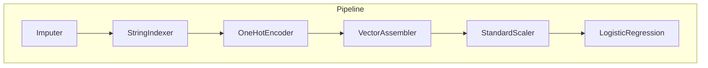

# Sesión 05
## Ingeniería de features a escala

<div class="pt-6 text-sm opacity-60">
El puente entre "procesar datos" y "entrenar modelos" — si esto está mal, ningún modelo lo compensa
</div>

---

# ¿Qué es una feature, exactamente?

Una **feature** es cualquier columna que un modelo usa para predecir — no el dato
crudo tal cual llega, sino una versión transformada, limpia y numérica de ese
dato. `amount` (el monto de una transacción) ya es una feature utilizable; pero
`currency` (texto: "MXN", "USD"...) no lo es hasta que se convierte en números.

<div class="mt-6 p-4 border-l-4 border-blue-500 text-left">
Encuestas de la industria (Kaggle State of ML, Google) reportan que los equipos
de ML pasan <b>60-80% de su tiempo</b> en esta etapa — no entrenando modelos,
preparando datos para que un modelo los pueda usar.
</div>

---

# Tres piezas, un solo objeto reproducible



Spark MLlib organiza todo esto con **tres abstracciones**, pensadas para que el
flujo completo (de datos crudos a predicción) sea un solo objeto reproducible:

<v-clicks>

- **Transformer** — toma un DataFrame y devuelve otro transformado, sin aprender
  nada de los datos primero. `VectorAssembler` (junta columnas en un vector) es
  así: la operación es la misma sin importar los datos.
- **Estimator** — un algoritmo que *aprende* vía `.fit()`. `StandardScaler` es
  un Estimator: `.fit()` calcula media y desviación estándar de tus datos de
  entrenamiento, y el resultado (`StandardScalerModel`) ya es un Transformer
  ajustado, listo para aplicarse a datos nuevos.
- **Pipeline** — encadena Transformers y Estimators en una sola secuencia.
  `.fit()` sobre el Pipeline completo entrena cada Estimator interno en orden,
  y produce un `PipelineModel`: un objeto que reproduce exactamente la misma
  secuencia sobre datos nuevos, sin que nadie tenga que recordar el orden.

</v-clicks>

---

# El mismo `PipelineModel`, reusado 3 veces

<div class="grid grid-cols-3 gap-4 mt-8 text-center text-sm">
<div class="p-4 border rounded">
<b>Sesión 5-6</b><br/>Se entrena y guarda
</div>
<div class="p-4 border rounded border-blue-500">
<b>Sesión 10</b><br/>Scoring en streaming
</div>
<div class="p-4 border rounded">
<b>Sesión 11</b><br/>Endpoint de serving
</div>
</div>

<div v-click class="mt-8">
No es una reimplementación en cada sesión — es <b>el mismo objeto</b>, cargado con <code>PipelineModel.load()</code>. Cuando lo guardas hoy con <code>.write().overwrite().save(...)</code>, estás guardando el pipeline completo — no solo el modelo final, también cada transformación que lo alimenta.
</div>

---

# El error que arruina un modelo sin que se note

```python {1-2|4-5}
# MAL: fuga de información
scaler.fit(df_completo)  # ve estadísticas del set de prueba

# BIEN: fit solo sobre train
scaler.fit(train_df)  # aplica lo aprendido a test_df después
```

<div v-click class="mt-6">

Si calculas la media/desviación de `StandardScaler` sobre **todo** el dataset
(incluyendo el set de prueba) antes de dividir en train/test, el modelo "ve"
estadísticas del conjunto que se supone debe evaluar a ciegas — un error sutil
que no truena en el notebook, solo hace que las métricas de evaluación mientan.

</div>

<div v-click class="mt-4 text-blue-500 font-bold">
El patrón correcto: .fit() solo sobre train_df, aplicar ese mismo Transformer ya aprendido sobre test_df
</div>

---

# Un detalle técnico que sí importa: `StringIndexer` a escala

`StringIndexer` necesita ver **todas** las categorías posibles antes de asignar
índices — sobre un dataset de millones de filas, eso implica un paso de
agregación distribuida completo antes de poder indexar. No es gratis solo
porque "es una sola columna".

<div class="mt-6 text-sm opacity-70">
Si `currency` tiene 200 monedas repartidas en 7.5GB de datos, Spark tiene que
recorrer las 7.5GB para saber que hay 200 categorías — exactamente lo que van a
ver correr en el lab de hoy.
</div>

---

# Feature stores: qué problema resuelven

<v-clicks>

- Sin uno: cada equipo recalcula sus features, con lógica ligeramente distinta
- Resultado: **training-serving skew** — el modelo se entrenó con una definición, producción usa otra
- Solución: una sola definición, calculada una vez, reutilizada por todos los modelos

</v-clicks>

<div v-click class="mt-8 text-sm opacity-70">
Este curso no implementa un feature store real (Feast, Vertex AI) — el PipelineModel cumple un rol similar a pequeña escala: una sola definición (S5), reutilizada sin cambios en S10 y S11.
</div>

---
layout: center
class: text-center
---

# Lab de hoy

Pipeline de features reproducible sobre **`bank_transactions.csv`** (~7.5 GB)

<div class="mt-4 text-sm opacity-70">
Paso 0: verificar que el cluster esté RUNNING antes de empezar — es el 4º cluster del curso, revisa que no quede uno huérfano de una sesión anterior
</div>

---

# Paso 1 — Cargar el dataset

```python
RUTA = "gs://<TU-BUCKET>/raw/bank_transactions/bank_transactions.csv"
df = spark.read.csv(RUTA, header=True, inferSchema=True)
df = df.withColumn("is_suspicious", F.col("is_suspicious").cast("int"))
df = df.withColumn("hora_del_dia", F.hour("timestamp"))
df.select("amount", "currency", "hora_del_dia", "is_suspicious").show(5)
```

<div class="mt-6 p-3 border-l-4 border-blue-500 text-sm text-left">
<b>Deberías ver:</b> 5 filas, con <code>hora_del_dia</code> ya como entero (0-23). <code>hora_del_dia</code> no viene en el CSV original — es la primera feature <i>creada</i>, no solo leída.
</div>

---

# Paso 2 — Construir el Pipeline, etapa por etapa

No lo pegues de un jalón — cada `Transformer`/`Estimator` se corre individual
antes de meterlo al Pipeline completo, para *ver* qué hace cada pieza:

```python {1-3|5-8|10-14}
# 1. Imputer
imputer = Imputer(inputCols=["amount", "hora_del_dia"],
                   outputCols=["amount_imputado", "hora_del_dia_imputada"])

# 2-3. Indexer + Encoder (¿cuántas columnas genera con 5 monedas?)
indexer = StringIndexer(inputCol="currency", outputCol="currency_idx", handleInvalid="keep")
encoder = OneHotEncoder(inputCols=["currency_idx"], outputCols=["currency_ohe"])

# 4-5. Assembler + Scaler
assembler = VectorAssembler(
    inputCols=["amount_imputado", "hora_del_dia_imputada", "currency_ohe"],
    outputCol="features_raw")
scaler = StandardScaler(inputCol="features_raw", outputCol="features")
```

---

# Paso 2 (cont.) — Armar el Pipeline completo

```python
pipeline = Pipeline(stages=[imputer, indexer, encoder, assembler, scaler])
modelo_features = pipeline.fit(df)
df_features = modelo_features.transform(df)
df_features.select("features").show(5, truncate=False)
```

<div class="mt-6 p-3 border-l-4 border-blue-500 text-sm text-left">
<b>Deberías ver:</b> una columna <code>features</code> con vectores en formato
<code>(n,[índices],[valores])</code> — es el formato disperso de Spark ML, no un
error si se ve raro la primera vez.
</div>

---

# Paso 3 — Guardar el pipeline

```python
modelo_features.write().overwrite().save(
    "gs://<TU-BUCKET>/modelos/features_bank_transactions"
)
```

<div class="mt-6 text-blue-500 font-bold">
Esto no es un archivo de configuración — es el pipeline completo, ya entrenado. La Sesión 6 lo carga tal cual para entrenar el modelo encima; la Sesión 10, para aplicarlo a datos en tiempo real.
</div>

---

# Paso 4 — Verificar reproducibilidad

```python
from pyspark.ml import PipelineModel
modelo_cargado = PipelineModel.load("gs://<TU-BUCKET>/modelos/features_bank_transactions")
muestra_nueva = df.sample(0.001, seed=99)
resultado = modelo_cargado.transform(muestra_nueva)
resultado.select("features").show(3, truncate=False)
```

<div class="mt-6 text-sm opacity-70">
Demuestra en vivo que el Pipeline guardado es reusable sobre datos que <b>nunca vio</b> en el .fit() original — la propiedad que hace posible la Sesión 10.
</div>

<div class="mt-4 p-4 border-l-4 border-blue-500 font-bold">
Entregable: pipeline de features serializado y reproducible en gs://&lt;TU-BUCKET&gt;/modelos/features_bank_transactions
</div>

---
layout: center
class: text-center
---

# → Sesión 06

Entrenamiento distribuido — algoritmos de MLlib, CrossValidator, y cuándo MLlib no alcanza
