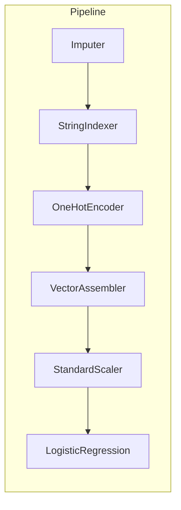

# Sesión 05
## Ingeniería de features a escala

<div class="pt-6 text-sm opacity-60">
El puente entre "procesar datos" y "entrenar modelos" — si esto está mal, ningún modelo lo compensa
</div>

---

# Tres piezas, un solo objeto reproducible



<v-clicks>

- **Transformer** — transforma, no aprende (`VectorAssembler`)
- **Estimator** — aprende vía `.fit()` (`StandardScaler`, el modelo mismo)
- **Pipeline** — encadena ambos en un solo objeto reproducible

</v-clicks>

---

# El mismo `PipelineModel`, reusado 3 veces

<div class="grid grid-cols-3 gap-4 mt-8 text-center text-sm">
<div class="p-4 border rounded">
<b>Sesión 5-6</b><br/>Se entrena y guarda
</div>
<div class="p-4 border rounded border-blue-500">
<b>Sesión 10</b><br/>Scoring en streaming
</div>
<div class="p-4 border rounded">
<b>Sesión 11</b><br/>Endpoint de serving
</div>
</div>

<div v-click class="mt-8">
No es una reimplementación en cada sesión — es <b>el mismo objeto</b>, cargado con <code>PipelineModel.load()</code>
</div>

---

# El error que arruina un modelo sin que se note

```python {1-2|4-5}
# MAL: fuga de información
scaler.fit(df_completo)  # ve estadísticas del set de prueba

# BIEN: fit solo sobre train
scaler.fit(train_df)  # aplica lo aprendido a test_df después
```

<div v-click class="mt-6 text-blue-500 font-bold">
El modelo "ve" el conjunto que se supone evalúa a ciegas
</div>

---

# Feature stores: qué problema resuelven

<v-clicks>

- Sin uno: cada equipo recalcula sus features, con lógica ligeramente distinta
- Resultado: **training-serving skew** — el modelo se entrenó con una definición, producción usa otra
- Solución: una sola definición, calculada una vez, reutilizada por todos los modelos

</v-clicks>

<div v-click class="mt-8 text-sm opacity-70">
Este curso no implementa un feature store real (Feast, Vertex AI) — el PipelineModel cumple un rol similar a pequeña escala
</div>

---

# Lab de hoy

Pipeline de features reproducible sobre **+5M filas** de `bank_transactions.csv`

```python
imputer = Imputer(inputCols=["amount", "hora_del_dia"], ...)
indexer = StringIndexer(inputCol="currency", ...)
pipeline = Pipeline(stages=[imputer, indexer, encoder, assembler, scaler])
```

<div class="mt-8 text-blue-500 font-bold">
Entregable: pipeline de features serializado y reproducible
</div>

---
layout: center
class: text-center
---

# → Sesión 06

Entrenamiento distribuido — algoritmos de MLlib, CrossValidator, y cuándo MLlib no alcanza
