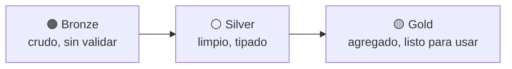

# Sesión 06
## Data Lakes / Lakehouse

<div class="pt-6 text-sm opacity-60">
Parquet bien organizado no es lo mismo que un lakehouse transaccional — hoy vemos por qué
</div>

---

# Tres formatos columnares, tres casos de uso

| Formato | Diseño | Mejor para |
|---|---|---|
| **Parquet** | Columnar + compresión | Analítica — el estándar en Spark/BigQuery |
| ORC | Columnar + índices integrados | Hive clásico |
| Avro | Por filas, esquema evolutivo | Streaming, ingesta evento por evento |

---

# Medallion: bronze → silver → gold



<div v-click class="mt-6 text-sm opacity-70">
recursos/etl-tipo-cambio/ (raw/ → processed/ → MariaDB) y 05_data_cleansing.ipynb — mismo patrón, a escala de 15GB
</div>

---

# Lo que Parquet plano no puede hacer

<div class="grid grid-cols-2 gap-6 mt-6">
<div class="p-4 border rounded">
<b>Con carpetas Parquet</b>
<ul class="text-sm mt-2">
<li>Corregir filas = reescribir el archivo entero</li>
<li>Ver el dato de ayer = solo si lo versionaste tú mismo</li>
<li>Agregar columna = rompe lectores existentes</li>
</ul>
</div>
<div class="p-4 border rounded border-blue-500">
<b>Con Iceberg</b>
<ul class="text-sm mt-2">
<li><code>MERGE INTO</code> — solo las filas afectadas</li>
<li>Time travel — <code>SELECT * FROM tabla.snapshots</code></li>
<li><code>ALTER TABLE ADD COLUMN</code> — sin tocar nada existente</li>
</ul>
</div>
</div>

---

# Time travel en acción

```sql {1-3|5-7}
SELECT snapshot_id, committed_at, operation
FROM local.curso_bigdata.transacciones_silver.snapshots
ORDER BY committed_at;

-- Consultar la tabla como estaba ANTES del MERGE
SELECT * FROM local.curso_bigdata.transacciones_silver
VERSION AS OF <snapshot_id>;
```

<div v-click class="mt-4 text-sm opacity-70">
recursos/lakehouse-iceberg/06_lakehouse_iceberg.py — las tres operaciones, sobre bank_transactions.csv
</div>

---

# Versionar datos y modelos no es como versionar código

<v-clicks>

- Datasets: **GB, no KB** — snapshots de Iceberg evitan duplicar lo que no cambió
- Modelos: sin versionar el dataset + hiperparámetros, "¿con qué se entrenó esto?" es irrespondible en 6 meses
- `04_pipeline_ml.ipynb` guarda el `PipelineModel` **completo** — feature engineering incluido, no solo el algoritmo

</v-clicks>

---

# Lab de hoy

1. Migrar la tabla de features a una tabla **Iceberg** real
2. Demostrar `MERGE INTO`, time travel, evolución de esquema

<div class="mt-8 text-blue-500 font-bold">
Entregable: diagrama de arquitectura + pipeline versionado + evidencia de las tres operaciones
</div>

---
layout: center
class: text-center
---

# → Sesión 07

Streaming e inferencia en tiempo real — windowing, watermarks, Pub/Sub Lite
