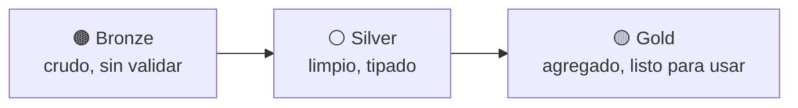

# Sesión 07
## Data Lakes / Lakehouse I
### Formatos y medallion

<div class="pt-6 text-sm opacity-60">
Primera de dos sesiones de lakehouse — hoy se prepara el terreno; la Sesión 8 resuelve las transacciones
</div>

---

# Tres formatos columnares, tres casos de uso

| Formato | Diseño | Mejor para |
|---|---|---|
| **Parquet** | Columnar + compresión | Analítica — el estándar en Spark/BigQuery |
| ORC | Columnar + índices integrados | Hive clásico |
| Avro | Por filas, esquema evolutivo | Streaming, ingesta evento por evento |

---

# Medallion: bronze → silver → gold



<div v-click class="mt-6 text-sm opacity-70">
recursos/etl-tipo-cambio/ (raw/ → processed/ → MariaDB) y 05_data_cleansing.ipynb — mismo patrón, a escala de 15GB
</div>

---

# Lo que Parquet plano NO puede hacer

<div class="grid grid-cols-1 gap-2 mt-6 text-left">

- Corregir un lote de filas ya cargado → reescribir el archivo/partición completa
- Ver el dato como estaba ayer → solo si guardaste una copia versionada tú mismo
- Agregar una columna nueva → rompe lectores existentes, o fuerza a versionar toda la carpeta

</div>

<div v-click class="mt-8 text-xl text-blue-500 text-center">
Eso es lo que resuelve un lakehouse transaccional (Iceberg/Delta) — la Sesión 8
</div>

---

# Lab de hoy

Preparar el cluster con el runtime de Iceberg y crear la primera tabla:

```bash
--properties="spark:spark.jars.packages=org.apache.iceberg:iceberg-spark-runtime-3.5_2.12:1.6.1,..."
```

1. Cargar `bank_transactions.csv` como bronze
2. Escribirlo como tabla **silver** particionada en Iceberg
3. Confirmar el snapshot inicial

<div class="mt-6 text-blue-500 font-bold">
Entregable: tabla Iceberg creada y cargada + captura del primer snapshot
</div>

---
layout: center
class: text-center
---

# → Sesión 08

Data Lakes / Lakehouse II — MERGE INTO, time travel, evolución de esquema
