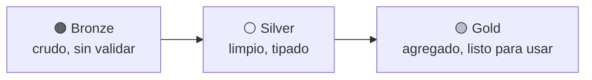

# Sesión 07
## Data Lakes / Lakehouse I
### Formatos y medallion

<div class="pt-6 text-sm opacity-60">
Primera de dos sesiones de lakehouse — hoy se prepara el terreno; la Sesión 8 resuelve las transacciones
</div>

---

# Tres formatos columnares, tres casos de uso

| Formato | Diseño | Mejor para |
|---|---|---|
| **Parquet** | Columnar + compresión | Analítica — el estándar en Spark/BigQuery |
| ORC | Columnar + índices integrados | Hive clásico |
| Avro | Por filas, esquema evolutivo | Streaming, ingesta evento por evento |

<div v-click class="mt-6 text-sm opacity-70">
Este curso usa Parquet porque el patrón de acceso es "escribir en lote, leer
analíticamente" — Avro tendría más sentido si escribiéramos evento por evento
(lo que sí pasa en la Sesión 9-10)
</div>

---

# Medallion: bronze → silver → gold



<div v-click class="mt-6 text-sm opacity-70">
recursos/etl-tipo-cambio/ (raw/ → processed/ → MariaDB) y 05_data_cleansing.ipynb — mismo patrón, a escala de 15GB
</div>

---

# Lo que Parquet plano NO puede hacer

<div class="grid grid-cols-1 gap-2 mt-6 text-left">

- Corregir un lote de filas ya cargado → reescribir el archivo/partición completa
- Ver el dato como estaba ayer → solo si guardaste una copia versionada tú mismo
- Agregar una columna nueva → rompe lectores existentes, o fuerza a versionar toda la carpeta

</div>

<div v-click class="mt-8 text-xl text-blue-500 text-center">
Eso es lo que resuelve un lakehouse transaccional (Iceberg/Delta) — la Sesión 8
</div>

---

# Paso 1 — Crear el cluster con runtime de Iceberg

```bash
gcloud dataproc clusters create curso-cluster \
    --region=us-central1 --num-workers=3 \
    --properties="^#^spark:spark.jars.packages=org.apache.iceberg:iceberg-spark-runtime-3.5_2.12:1.6.1#spark:spark.sql.extensions=org.apache.iceberg.spark.extensions.IcebergSparkSessionExtensions#spark:spark.sql.catalog.local=org.apache.iceberg.spark.SparkCatalog#spark:spark.sql.catalog.local.type=hadoop#spark:spark.sql.catalog.local.warehouse=gs://$BUCKET_NAME/curso-bigdata/lakehouse"
```

<div class="mt-4 p-3 border-l-4 border-blue-500 text-sm text-left">
<b>Deberías ver:</b> <code>spark.sql("SHOW CATALOGS").show()</code> debe listar
<code>local</code> — si no aparece, revisa el separador <code>^#^</code> exacto
</div>

---

# Paso 2 — Cargar bronze y crear la tabla silver

```python
bronze = spark.read.csv(RUTA_BANK_TRANSACTIONS, header=True, inferSchema=True)
bronze = bronze.withColumn("is_suspicious", F.col("is_suspicious").cast("int"))
bronze = bronze.withColumn("hora_del_dia", F.hour("timestamp"))

spark.sql("CREATE NAMESPACE IF NOT EXISTS local.curso_bigdata")
(
    bronze.select("transaction_id", "timestamp", "amount", "currency", "hora_del_dia", "is_suspicious")
    .writeTo("local.curso_bigdata.transacciones_silver")
    .using("iceberg")
    .partitionedBy("currency")
    .createOrReplace()
)
```

---

# Paso 3 — Confirmar el snapshot inicial

```sql
SELECT snapshot_id, committed_at, operation
FROM local.curso_bigdata.transacciones_silver.snapshots;
```

<div class="mt-6">
Esta consulta no existe en Parquet plano — es la primera evidencia de que ya
no trabajas con archivos sueltos, sino con una tabla real con historia.
</div>

<div class="mt-6 p-4 border-l-4 border-blue-500 font-bold">
Entregable: tabla Iceberg creada y cargada + captura del primer snapshot
</div>

<div class="mt-4 text-sm opacity-70">
No apagues el cluster — la Sesión 8 retoma esta misma tabla
</div>

---
layout: center
class: text-center
---

# → Sesión 08

Data Lakes / Lakehouse II — MERGE INTO, time travel, evolución de esquema
