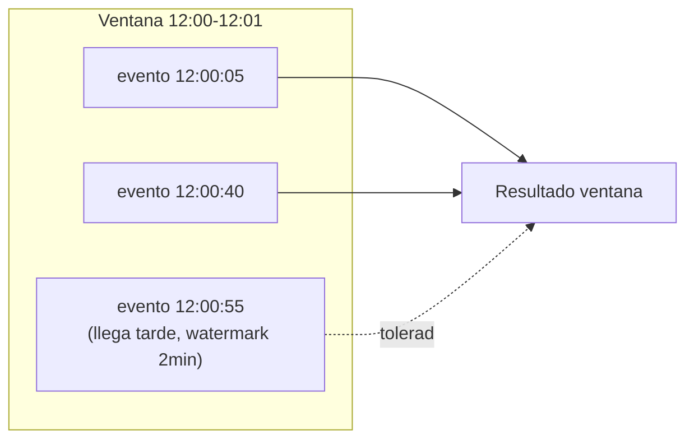
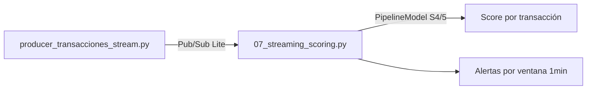

# Sesión 07
## Streaming e inferencia en tiempo real

<div class="pt-6 text-sm opacity-60">
El modelo de la Sesión 4/5 se reutiliza sin cambios — lo que cambia es el contexto: datos que nunca terminan de llegar
</div>

---

# Windowing + watermark



```python
scoreadas
    .withWatermark("timestamp", "2 minutes")
    .groupBy(F.window("timestamp", "1 minute"))
    .count()
```

---

# Exactly-once ≠ sin duplicados en el broker

<v-clicks>

- El checkpoint + watermark dan exactly-once en el **cálculo de la ventana**
- Esa es una garantía distinta de "el mensaje nunca llegó dos veces"
- Esa segunda garantía la da **Pub/Sub Lite**, del lado del envío

</v-clicks>

<div v-click class="mt-8 p-4 border-l-4 border-blue-500">
Confundir ambas garantías lleva a asumir más seguridad de la que realmente se tiene
</div>

---

# Dos patrones de scoring en tiempo real

| Patrón | Cómo | Trade-off |
|---|---|---|
| **Modelo en el stream** | `PipelineModel` cargado una vez, aplicado directo | Baja latencia, se actualiza solo al reiniciar el job |
| Endpoint externo | `POST` HTTP por evento/microlote | Se actualiza sin tocar el streaming, a cambio de latencia de red |

<div v-click class="mt-6 text-sm opacity-70">
Este curso usa el primero en streaming (Sesión 7) y el segundo en serving (Sesión 8) — mismo modelo, comparación directa
</div>

---

# Feature freshness: un detalle que rompe modelos en producción

```python {1|3}
# BIEN: derivado del timestamp del EVENTO
.withColumn("hora_del_dia", F.hour("timestamp"))

# MAL: derivado del momento de PROCESAMIENTO
.withColumn("hora_del_dia", F.hour(F.current_timestamp()))
```

<div v-click class="mt-6 text-blue-500 font-bold">
Si el stream se atrasa, la versión "MAL" queda sistemáticamente equivocada
</div>

---

# Pipeline de hoy



<div class="mt-6 text-blue-500 font-bold">
Entregable: pipeline funcionando end-to-end — captura de ventanas en vivo + Parquet de scores
</div>

---
layout: center
class: text-center
---

# → Sesión 08

Model serving, monitoreo y MLOps — endpoint, drift (PSI), Airflow
