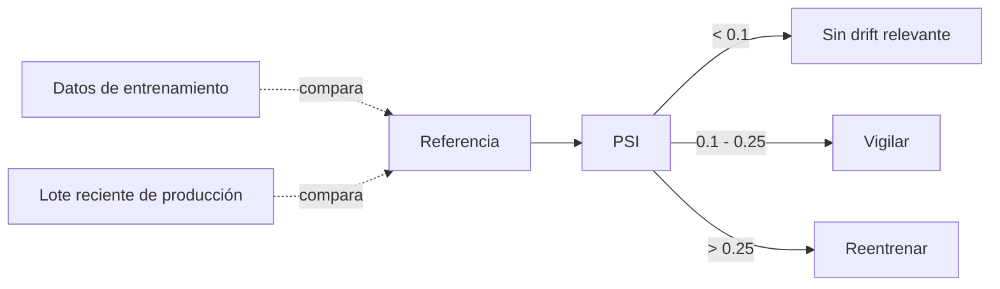
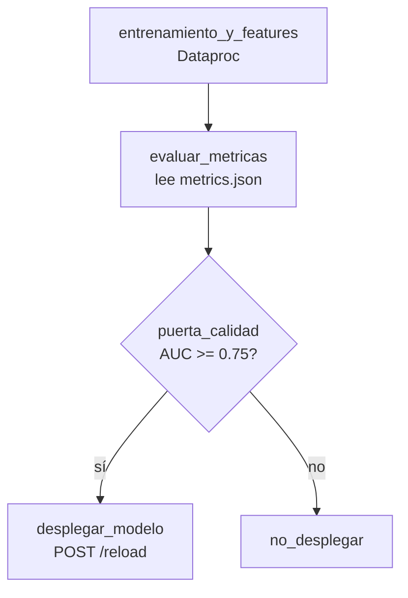

# Sesión 08
## Model serving, monitoreo y MLOps

Un modelo que nadie puede consultar no sirve, y uno sin monitoreo se degrada sin que nadie note. Hoy se cierra el ciclo.

---

# Tres patrones de serving

| Patrón | Latencia | Ejemplo en el curso |
|---|---|---|
| Batch | Minutos/horas, sin restricción por petición | — |
| **Online (síncrono)** | &lt;1s por petición | `serve_fraude.py` — `POST /score` |
| Streaming | Continuo, sin petición explícita | Sesión 7 |

serve_fraude.py carga el PipelineModel en Spark local — un cluster completo tiene overhead de coordinación que lo hace mal candidato para responder 1 petición rápido

---

# Drift: el modelo se degrada sin que nadie lo note

monitor_drift.py — Population Stability Index sobre `amount`, 10 buckets de percentiles

---

# El DAG de MLOps

mlops_pipeline_dag.py — reintentos automáticos, decisión condicional real, visibilidad de qué falló y dónde

---

# Por qué esto no es solo "el script de siempre"

<v-clicks>

- `run_etl.py` (etl-tipo-cambio) es secuencial — si algo falla, hay que leer el log completo
- Un DAG da dependencias explícitas + reintentos por tarea + una decisión condicional real
- El trigger de reentrenamiento puede ser **drift**, no solo el schedule semanal

</v-clicks>

---

# Lab de hoy

1. Desplegar el endpoint (`serve_fraude.py`)
2. Correr `monitor_drift.py` sobre los scores de la Sesión 7
3. Desplegar el DAG en Airflow

Entregable: DAG corriendo + endpoint respondiendo + corrida de monitoreo con PSI interpretado

---
layout: center
class: text-center
---

# → Sesión 09

Gobernanza, seguridad y capstone técnico
