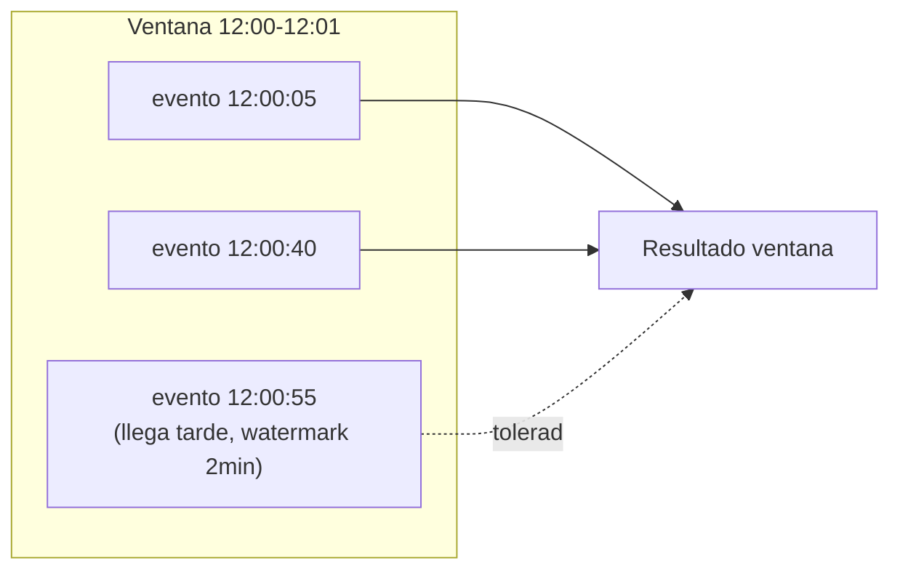
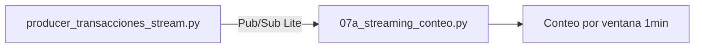

# Sesión 09
## Streaming I
### Fundamentos y setup

<div class="pt-6 text-sm opacity-60">
Datos que nunca terminan de llegar — hoy el mecanismo, sin modelo todavía. La Sesión 10 agrega el scoring.
</div>

---

# Windowing + watermark



```python
transacciones
    .withWatermark("timestamp", "2 minutes")
    .groupBy(F.window("timestamp", "1 minute"), "currency")
    .count()
```

---

# Exactly-once ≠ sin duplicados en el broker

<v-clicks>

- El checkpoint + watermark dan exactly-once en el **cálculo de la ventana**
- Esa es una garantía distinta de "el mensaje nunca llegó dos veces"
- Esa segunda garantía la da **Pub/Sub Lite**, del lado del envío

</v-clicks>

<div v-click class="mt-8 p-4 border-l-4 border-blue-500">
Confundir ambas garantías lleva a asumir más seguridad de la que realmente se tiene
</div>

---

# Por qué Pub/Sub Lite

<v-clicks>

- Spark no tiene conector nativo para Pub/Sub estándar
- **Pub/Sub Lite sí** — el único conector oficial de Google para Structured Streaming
- Se cobra por capacidad reservada, no por mensaje (no es Always Free)

</v-clicks>

```bash
gcloud pubsub lite-topics create transacciones-stream --location=us-central1-a --partitions=1 --per-partition-bytes=30GiB
gcloud pubsub lite-subscriptions create transacciones-stream-sub --location=us-central1-a --topic=transacciones-stream
```

---

# Lab de hoy



Deliberadamente **sin modelo** — para ver windowing/watermarks funcionar solos.

<div class="mt-6 text-blue-500 font-bold">
Entregable: captura de las ventanas de conteo actualizándose en consola
</div>

---
layout: center
class: text-center
---

# → Sesión 10

Streaming II — inferencia en tiempo real con el modelo de la Sesión 6
