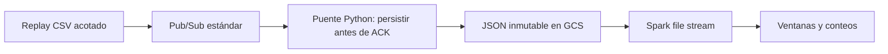

# Sesión 09
## Streaming I
### Pub/Sub estándar, microlotes y tiempo de evento

---

# Un archivo nuevo puede formar parte de un stream


```mermaid
flowchart LR
 P[Replay CSV acotado] --> Q[Pub/Sub estándar]
 Q --> B[Puente Python: persistir antes de ACK]
 B --> G[JSON inmutable en GCS]
 G --> S[Spark file stream]
 S --> W[Ventanas y conteos]
```

Medir latencia por microlotes; no prometer respuesta de milisegundos.

---

# El watermark avanza con los eventos observados

- Tiempo del evento: cuándo ocurrió la transacción.
- Tiempo de procesamiento: cuándo llega al motor.
- Tolerancia de 2 minutos respecto al máximo observado: acota estado.
- Un replay histórico conserva sus fechas; el reloj de pared no lo vuelve inválido por sí solo.

```python
conteo = transacciones.groupBy(
    F.window("timestamp", "1 minute"), "currency"
).count()
```

---

# Watermark, checkpoint y deduplicación resuelven problemas distintos

| Mecanismo | Resuelve | Límite |
|---|---|---|
| Watermark | Estado y eventos tardíos | No da unicidad por sí solo |
| Checkpoint | Continuidad y recuperación | Es propio de cada consulta |
| Deduplicación por ID | Reentregas dentro del horizonte | No es historial ilimitado |

La consola permite ver actualizaciones; no es una prueba de exactly-once end-to-end.

---

# Pub/Sub estándar reemplaza una dependencia retirada

Pub/Sub Lite cerró el 18 de marzo de 2026. El lab usa Pub/Sub estándar con un puente explícito a GCS.

```bash
gcloud pubsub topics create transacciones-stream
gcloud pubsub subscriptions create transacciones-stream-sub \
  --topic=transacciones-stream --ack-deadline=120
```

Ver permisos y presupuesto antes del lab en `recursos/streaming/README.md`.

---

# Lab: persistir antes de confirmar

Iniciar el puente primero; su ejecución está acotada a 180 segundos.

```bash
python recursos/streaming/pubsub_to_gcs.py \
  --project "$PROJECT_ID" --bucket "$BUCKET_NAME" \
  --prefix "streaming/$STREAM_RUN/entrada" --seconds 180
```

Un fallo de escritura deja el mensaje sin ACK; reintentar no equivale a asegurar que nunca hay duplicados.

---

# Publicar una muestra conserva memoria y crédito

```bash
python recursos/streaming/producer_transacciones_stream.py \
  --project "$PROJECT_ID" --csv bank_transactions.csv \
  --tasa 20 --max-events 1200
```

El productor lee secuencialmente y omite labels. Crear primero el prefijo con un evento de prueba; iniciar Spark y continuar el replay para observar nuevas entradas.

---

# El consumidor usa una entrada y un checkpoint exclusivos

```bash
gcloud dataproc jobs submit pyspark \
  gs://$BUCKET_NAME/scripts/07a_streaming_conteo.py \
  --cluster=curso-cluster --region=us-central1 \
  --py-files=gs://$BUCKET_NAME/scripts/stream_common.py -- \
  --input gs://$BUCKET_NAME/streaming/$STREAM_RUN/entrada \
  --checkpoint gs://$BUCKET_NAME/streaming/$STREAM_RUN/checkpoints/conteo \
  --seconds 180
```

`STREAM_RUN` identifica la ejecución. Usar otro prefijo al cambiar el experimento.

---

# La evidencia incluye una repetición y un evento tardío

- Capturar una ventana finalizada (`append`) y explicar qué tiempo agrupa.
- Repetir un ID y observar deduplicación dentro del horizonte.
- Agregar un evento fuera del horizonte y explicar el resultado.
- Registrar latencia, estado y condiciones de recuperación.

Detener productor/puente y borrar el cluster tras guardar la evidencia.

---

# → Sesión 10

Mismo contrato y stream, ahora con el pipeline de ML completo de S6.
