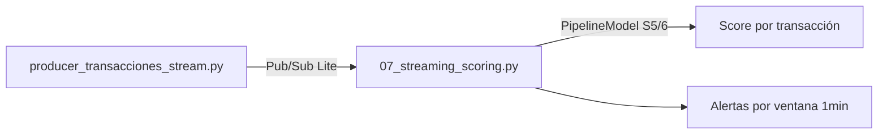

# Sesión 10
## Streaming II
### Inferencia en tiempo real

<div class="pt-6 text-sm opacity-60">
El modelo de la Sesión 6 se reutiliza sin cambios — mismo pipeline de la Sesión 9, con scoring agregado
</div>

---

# Dos patrones de scoring en tiempo real

| Patrón | Cómo | Trade-off |
|---|---|---|
| **Modelo en el stream** | `PipelineModel` cargado una vez, aplicado directo | Baja latencia, se actualiza solo al reiniciar el job |
| Endpoint externo | `POST` HTTP por evento/microlote | Se actualiza sin tocar el streaming, a cambio de latencia de red |

<div v-click class="mt-6 text-sm opacity-70">
Este curso usa el primero hoy y el segundo en serving (Sesión 11) — mismo modelo, comparación directa
</div>

<div v-click class="mt-4 text-sm opacity-70">
¿Por qué PipelineModel.transform() funciona igual en streaming? Ninguna etapa
(Imputer, Indexer, Encoder, Assembler, Scaler, LogisticRegression, ya fit)
mantiene estado nuevo entre filas — todas son row-wise.
</div>

---

# Feature freshness: un detalle que rompe modelos en producción

```python {1|3}
# BIEN: derivado del timestamp del EVENTO
.withColumn("hora_del_dia", F.hour("timestamp"))

# MAL: derivado del momento de PROCESAMIENTO
.withColumn("hora_del_dia", F.hour(F.current_timestamp()))
```

<div v-click class="mt-6 text-blue-500 font-bold">
Si el stream se atrasa, la versión "MAL" queda sistemáticamente equivocada
</div>

---

# Pipeline de hoy



Mismo esqueleto de la Sesión 9 (`07a_streaming_conteo.py`) + el modelo cargado

---

# Correr el pipeline completo

```bash
python producer_transacciones_stream.py --project <PROJECT_ID> --tasa 20
```

```bash
spark-submit --master yarn 07_streaming_scoring.py \
    --project <PROJECT_ID> --subscription transacciones-stream-sub \
    --modelo gs://<TU-BUCKET>/modelos/fraude_bank_transactions_pipeline \
    --salida gs://<TU-BUCKET>/streaming/scores
```

<div class="mt-4 p-3 border-l-4 border-blue-500 text-sm text-left">
<b>Deberías ver:</b> el Parquet de scores escribiéndose (<code>gsutil ls</code>
en otra terminal) + ventanas de alertas en consola cada 30s
</div>

<div class="mt-4 p-4 border-l-4 border-blue-500 font-bold">
Entregable: pipeline funcionando end-to-end — captura de ventanas en vivo + Parquet de scores
</div>

---
layout: center
class: text-center
---

# → Sesión 11

Model serving y monitoreo — endpoint, drift (PSI)
