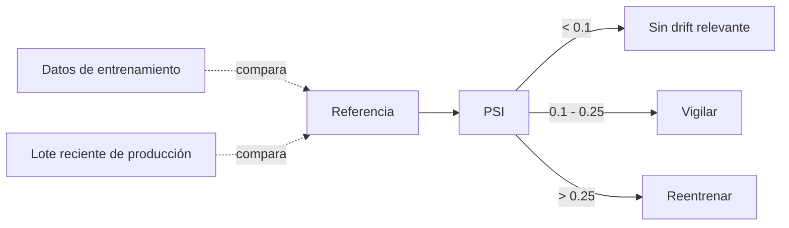

# Sesión 11
## Model serving y monitoreo

Un modelo que nadie puede consultar no sirve, y uno sin monitoreo se degrada sin que nadie note

---

# Tres patrones de serving

| Patrón | Latencia | Ejemplo en el curso |
|---|---|---|
| Batch | Minutos/horas, sin restricción por petición | — |
| **Online (síncrono)** | &lt;1s por petición | `serve_fraude.py` — `POST /score` |
| Streaming | Continuo, sin petición explícita | Sesión 10 |

serve_fraude.py carga el PipelineModel en Spark local — un cluster completo tiene overhead de coordinación que lo hace mal candidato para responder 1 petición rápido

---

# Drift: el modelo se degrada sin que nadie lo note

monitor_drift.py — Population Stability Index sobre `amount`, 10 buckets de percentiles

PSI > 0.25 es la señal que la Sesión 12 conecta a un disparador real de reentrenamiento

---

# Lab de hoy

1. Desplegar el endpoint (`serve_fraude.py`)
2. Correr `monitor_drift.py` sobre los scores de la Sesión 10

Entregable: endpoint respondiendo + corrida de monitoreo con PSI interpretado

---
layout: center
class: text-center
---

# → Sesión 12

MLOps con Airflow — orquestando todo el ciclo
