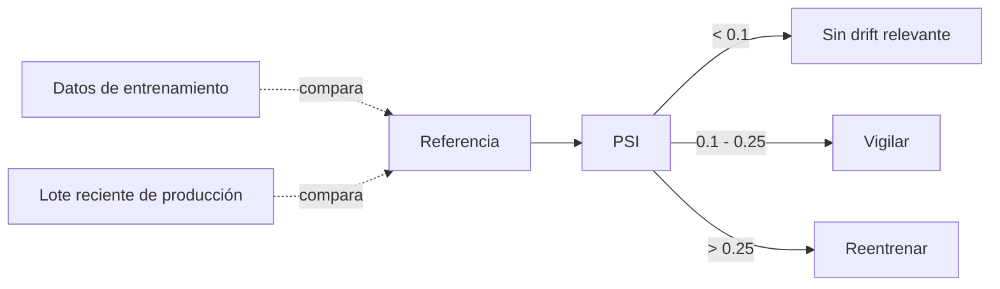

# Sesión 11
## Model serving y monitoreo

<div class="pt-6 text-sm opacity-60">
Un modelo que nadie puede consultar no sirve, y uno sin monitoreo se degrada sin que nadie note
</div>

---

# Tres patrones de serving

| Patrón | Latencia | Ejemplo en el curso |
|---|---|---|
| Batch | Minutos/horas, sin restricción por petición | — |
| **Online (síncrono)** | &lt;1s por petición | `serve_fraude.py` — `POST /score` |
| Streaming | Continuo, sin petición explícita | Sesión 10 |

<div v-click class="mt-6 text-sm opacity-70">
serve_fraude.py carga el PipelineModel en Spark local — un cluster completo tiene overhead de coordinación que lo hace mal candidato para responder 1 petición rápido
</div>

---

# Drift: el modelo se degrada sin que nadie lo note



<div v-click class="mt-4 text-sm opacity-70">
monitor_drift.py — Population Stability Index sobre `amount`, 10 buckets de percentiles
</div>

<div v-click class="mt-4 text-blue-500 font-bold">
PSI > 0.25 es la señal que la Sesión 12 conecta a un disparador real de reentrenamiento
</div>

<div v-click class="mt-4 text-sm opacity-70">
Drift de datos (la distribución de entrada cambia) ≠ drift de modelo/concept drift (la relación features→resultado cambia) — PSI mide el primero
</div>

---
layout: center
class: text-center
---

# Lab de hoy

---

# Paso 1 — Desplegar el endpoint

```bash
pip install fastapi uvicorn pyspark
MODELO=gs://<TU-BUCKET>/modelos/fraude_bank_transactions_pipeline \
  uvicorn serve_fraude:app --host 0.0.0.0 --port 8080
```

```bash
curl -X POST localhost:8080/score -H "Content-Type: application/json" -d '{
  "transaction_id": "t1", "timestamp": "2026-03-01T14:00:00", "amount": 12000, "currency": "MXN"
}'
```

<div class="mt-4 text-sm opacity-70">
Deberías ver: JSON con es_sospechosa_pred y prob_sospechosa. Primera petición tarda (Spark inicializando); las siguientes son rápidas.
</div>

---

# Paso 2 — Monitoreo de drift

```bash
python monitor_drift.py \
    --referencia gs://<TU-BUCKET>/raw/bank_transactions/bank_transactions.csv \
    --lote_reciente gs://<TU-BUCKET>/streaming/scores \
    --columna amount
```

<div class="mt-4 text-sm opacity-70">
Deberías ver: un PSI impreso con su interpretación ("sin drift relevante", "vigilar", "considerar reentrenar")
</div>

<div class="mt-4 p-4 border-l-4 border-blue-500 font-bold">
Entregable: endpoint respondiendo + corrida de monitoreo con PSI interpretado
</div>

---
layout: center
class: text-center
---

# → Sesión 12

MLOps con Airflow — orquestando todo el ciclo
