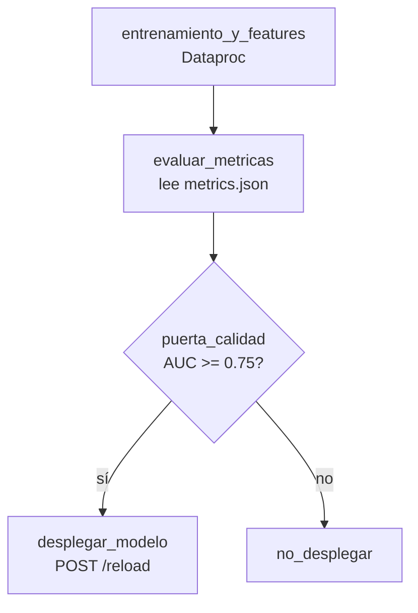

# Sesión 12
## MLOps con Airflow

La Sesión 11 dejó un endpoint y una señal de drift — hoy se conecta todo en un ciclo automatizado

---

# El DAG de MLOps

mlops_pipeline_dag.py — reintentos automáticos, decisión condicional real, visibilidad de qué falló y dónde

---

# Por qué esto no es solo "el script de siempre"

<v-clicks>

- `run_etl.py` (etl-tipo-cambio) es secuencial — si algo falla, hay que leer el log completo
- Un DAG da dependencias explícitas + reintentos por tarea + una decisión condicional real
- El trigger de reentrenamiento puede ser **drift** (Sesión 11), no solo el schedule semanal

</v-clicks>

---

# Trece sesiones, un solo sistema

S5 Features

S6 Entrenamiento

S7-8 Lakehouse

S9-10 Streaming

S11 Serving/drift

S12 Airflow (hoy)

Hoy, por primera vez, todas las piezas corren automatizadas como un solo sistema

---

# Lab de hoy

Desplegar `mlops_pipeline_dag.py` en Airflow y correrlo end-to-end:

ingesta → features → entrenamiento → evaluación → despliegue condicional

Entregable: DAG corriendo (captura del grafo en verde), conectado al endpoint de la Sesión 11

---
layout: center
class: text-center
---

# → Sesión 13

Gobernanza, seguridad y capstone técnico
