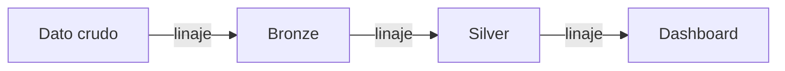

# Sesión 13
## Gobernanza, seguridad y capstone

Cómo un pipeline de curso se vuelve algo que un equipo de banca podría operar de verdad

---

# IAM a nivel tabla, no solo proyecto

<v-clicks>

- Módulo 0: IAM de proyecto — quién crea/borra recursos
- Hoy: **mínimo privilegio** por dataset/columna/fila
- Ej: un analista ve montos, no nombres completos sin enmascarar

</v-clicks>

"Todos con Owner porque es más simple" — exactamente lo que un auditor rechaza

---

# Data Catalog + linaje

Con 5 datasets, cualquiera recuerda qué hay en cada uno. Con 500, sin catálogo nadie sabe qué existe.

---

# Cumplimiento en banca: tres exigencias reales

| Exigencia | Por qué |
|---|---|
| **Explicabilidad** | Negar una transacción real necesita justificación, no solo un score |
| **Trazabilidad** | Cada predicción rastreable hasta modelo + dato exactos |
| **Retención/borrado** | Un lake particionado facilita borrar por petición del titular |

Regresión logística (Sesión 6) tiene ventaja aquí: coeficientes directamente interpretables

---

# FinOps: el costo es una decisión técnica disfrazada

<v-clicks>

- ¿Cuánto cuesta cada etapa del DAG? (ingesta, entrenamiento, serving)
- Reentrenar tiene costo explícito — **no** reentrenar con drift tiene costo implícito
- La puerta de calidad (AUC mínimo) **es** una decisión de FinOps

</v-clicks>

---

# El capstone: demostrar que las 8 sesiones son un solo sistema

✓ Ingesta distribuida

✓ Features con MLlib

✓ Modelo evaluado

✓ Serving programado

✓ Streaming/orquestación

✓ Visualización

✓ Evidencia de pruebas

Máx. 15 minutos — mismo límite institucional que Especialidad

---
layout: center
class: text-center
---

# Fin del programa técnico

Profundización sugerida: Iceberg/Delta avanzado · GPUs distribuidas · feature stores productivos · BigQuery ML
